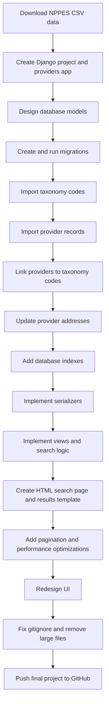

```mermaid
flowchart TD

A[Download NPPES CSV data] --> B[Create Django project and providers app]
B --> C[Design database models]
C --> D[Create and run migrations]

D --> E[Import taxonomy codes]
E --> F[Import provider records]
F --> G[Link providers to taxonomy codes]

G --> H[Update provider addresses]
H --> I[Add database indexes]

I --> J[Implement serializers]
J --> K[Implement views and search logic]

K --> L[Create HTML search page and results template]
L --> M[Add pagination and performance optimizations]

M --> N[Redesign UI]
N --> O[Fix gitignore and remove large files]

O --> P[Push final project to GitHub]
```
