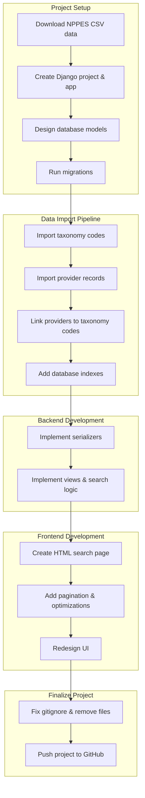

# Provider-Lookup

```mermaid
flowchart TD

subgraph Setup [Project Setup]
    A[Download NPPES CSV data]
    B[Create Django project & app]
    C[Design database models]
    D[Run migrations]
    A --> B --> C --> D
end

subgraph Import [Data Import Pipeline]
    E[Import taxonomy codes]
    F[Import provider records]
    G[Link providers to taxonomy codes]
    H[Add database indexes]
    D --> E --> F --> G --> H
end

subgraph Backend [Backend Development]
    I[Implement serializers]
    J[Implement views & search logic]
    H --> I --> J
end

subgraph Frontend [Frontend Development]
    K[Create HTML search page]
    L[Add pagination & optimizations]
    M[Redesign UI]
    J --> K --> L --> M
end

subgraph Finalize [Finalize Project]
    N[Fix gitignore & remove files]
    O[Push project to GitHub]
    M --> N --> O
end
```
